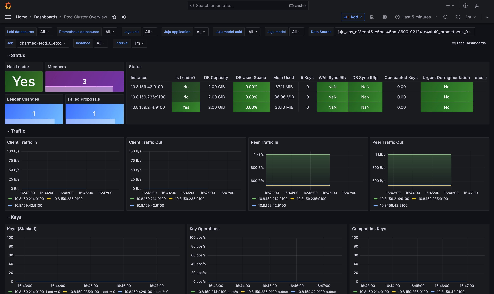

(enable-monitoring)=
# How to enable monitoring

The [Canonical Observability Stack (COS)](https://charmhub.io/topics/canonical-observability-stack) is a set of tools that facilitates gathering, processing, visualizing, and setting up alerts on telemetry signals generated by workloads in and outside of Juju.

The etcd charm can use COS to connect to [Grafana](https://grafana.com/) and [Prometheus](https://prometheus.io/) to use monitoring, alert rules, and logging features.

## Deploy COS

Deploy the [`cos-lite`](https://charmhub.io/topics/canonical-observability-stack) bundle in a Kubernetes controller following the [MicroK8s guide](https://charmhub.io/topics/canonical-observability-stack/tutorials/install-microk8s). 

Since the etcd charm is deployed directly on a cloud infrastructure environment, it requires offering the endpoints of the COS relations with the [offers-overlay](https://github.com/canonical/cos-lite-bundle/blob/main/overlays/offers-overlay.yaml). For instructions on how to do this, see the section [Deploy the COS Lite bundle with overlays](https://charmhub.io/topics/canonical-observability-stack/tutorials/install-microk8s#heading--deploy-the-cos-lite-bundle-with-overlays) of the MicroK8s guide.

Once the COS bundle is deployed, you should have Grafana and Prometheus running in your Kubernetes cluster. 

The output of `juju status` should look similar to the following:

```text
Model  Controller  Cloud/Region        Version  SLA          Timestamp
cos    k8s         microk8s/localhost  3.6.4    unsupported  12:26:22Z

App           Version  Status  Scale  Charm             Channel        Rev  Address         Exposed  Message
alertmanager  0.27.0   active      1  alertmanager-k8s  latest/stable  154  10.152.183.216  no
catalogue              active      1  catalogue-k8s     latest/stable   80  10.152.183.174  no
grafana       9.5.3    active      1  grafana-k8s       latest/stable  138  10.152.183.234  no
loki          2.9.6    active      1  loki-k8s          latest/stable  186  10.152.183.31   no
prometheus    2.52.0   active      1  prometheus-k8s    latest/stable  232  10.152.183.55   no
traefik       2.11.0   active      1  traefik-k8s       latest/stable  232  10.152.183.116  no       Serving at 125.121.179.159

Unit             Workload  Agent  Address       Ports  Message
alertmanager/0*  active    idle   10.1.153.187
catalogue/0*     active    idle   10.1.153.177
grafana/0*       active    idle   10.1.153.189
loki/0*          active    idle   10.1.153.188
prometheus/0*    active    idle   10.1.153.190
traefik/0*       active    idle   10.1.153.186         Serving at 125.121.179.159
```

## Offer interfaces from the COS model

While still in the COS model, offer COS interfaces to be cross-model related with the machine model that you are using to deploy the etcd charm:

```text
juju offer grafana:grafana-dashboard
juju offer loki:logging
juju offer prometheus:receive-remote-write
```

## Consume offers on the etcd model

Switch to the machine model running etcd and run the following commands to consume the COS offers:

```text
juju switch <machine_model_name>

juju consume k8s:admin/cos.prometheus-receive-remote-write
juju consume k8s:admin/cos.loki-logging
juju consume k8s:admin/cos.grafana-dashboards
```

In the commands above, `k8s` refers to the controller where the COS-lite bundle is deployed, and `cos` refers to the COS model.

## Deploy `grafana-agent`

The [Grafana agent](https://charmhub.io/grafana-agent) is a lightweight, open-source agent that runs on your host and sends metrics and logs to Grafana Cloud. The Grafana agent is deployed as a sidecar container in the etcd charm. 

To deploy the Grafana agent, run the following command:

```text
juju deploy grafana-agent --base ubuntu@24.04
```

Once the Grafana agent is deployed, integrate it with the etcd charm by running the following command:

```text
juju integrate grafana-agent charmed-etcd
```

Once the model stabilizes, you should see the Grafana agent running as a sidecar container in the etcd charm. Run `juju status` to see the status of the etcd model. The output should look similar to the following:

```text
Model  Controller  Cloud/Region         Version  SLA          Timestamp
etcd   vm          localhost/localhost  3.6.4    unsupported  12:33:25Z

App            Version  Status   Scale  Charm          Channel      Rev  Exposed  Message
charmed-etcd            active       3  charmed-etcd                  0  no
grafana-agent           blocked      3  grafana-agent  latest/edge  457  no       Missing ['grafana-cloud-config']|['grafana-dashboards-provider']|['logging-consumer']|['s
end-remote-write'] for cos-a...

Unit                Workload  Agent  Machine  Public address  Ports  Message
charmed-etcd/0*     active    idle   0        10.8.159.214
  grafana-agent/3   blocked   idle            10.8.159.214           Missing ['grafana-cloud-config']|['grafana-dashboards-provider']|['logging-consumer']|['send-remote-write'] for cos-a...
charmed-etcd/1      active    idle   1        10.8.159.42
  grafana-agent/2   blocked   idle            10.8.159.42            Missing ['grafana-cloud-config']|['grafana-dashboards-provider']|['logging-consumer']|['send-remote-write'] for cos-a...
charmed-etcd/2      active    idle   2        10.8.159.235
  grafana-agent/0*  blocked   idle            10.8.159.235           Missing ['grafana-cloud-config']|['grafana-dashboards-provider']|['logging-consumer']|['send-remote-write'] for cos-a...

Machine  State    Address       Inst id        Base          AZ  Message
0        started  10.8.159.214  juju-604e01-0  ubuntu@24.04      Running
1        started  10.8.159.42   juju-604e01-1  ubuntu@24.04      Running
2        started  10.8.159.235  juju-604e01-2  ubuntu@24.04      Running
```

Currently `grafana-agent` is blocked because it is missing the required relations. To unblock the `grafana-agent` unit, run the following commands:

```text
juju integrate grafana-agent prometheus-receive-remote-write
juju integrate grafana-agent loki-logging
juju integrate grafana-agent grafana-dashboards
```

Once the model stabilizes, the `grafana-agent` unit should be active and running as a sidecar container in the etcd charm. It should periodically scrape metrics from the etcd charm and send them to Grafana Cloud.

Run `juju status` to see the status of the etcd model. The output should look similar to the following:

```text
Model  Controller  Cloud/Region         Version  SLA          Timestamp
etcd   vm          localhost/localhost  3.6.4    unsupported  12:36:27Z

SAAS                             Status  Store  URL
grafana-dashboards               active  k8s    admin/cos.grafana-dashboards
loki-logging                     active  k8s    admin/cos.loki-logging
prometheus-receive-remote-write  active  k8s    admin/cos.prometheus-receive-remote-write

App            Version  Status  Scale  Charm          Channel      Rev  Exposed  Message
charmed-etcd            active      3  charmed-etcd                  0  no
grafana-agent           active      3  grafana-agent  latest/edge  457  no       tracing: off

Unit                Workload  Agent      Machine  Public address  Ports  Message
charmed-etcd/0*     active    idle       0        10.8.159.214
  grafana-agent/3   active    executing           10.8.159.214           tracing: off
charmed-etcd/1      active    idle       1        10.8.159.42
  grafana-agent/2   active    executing           10.8.159.42            tracing: off
charmed-etcd/2      active    idle       2        10.8.159.235
  grafana-agent/0*  active    executing           10.8.159.235           tracing: off

Machine  State    Address       Inst id        Base          AZ  Message
0        started  10.8.159.214  juju-604e01-0  ubuntu@24.04      Running
1        started  10.8.159.42   juju-604e01-1  ubuntu@24.04      Running
2        started  10.8.159.235  juju-604e01-2  ubuntu@24.04      Running
```

## Access the Grafana dashboard

To get the Grafana dashboard URL, run the following command:

```text
juju switch k8s

juju run traefik/0 show-proxied-endpoints --format=yaml \
  | yq '."traefik/0".results."proxied-endpoints"' \
  | jq
```

In the output, look for the `grafana` endpoint. The URL should look similar to the following:

```json
{
  "traefik": {
    "url": "http://125.121.179.159"
  },
  "prometheus/0": {
    "url": "http://125.121.179.159/cos-prometheus-0"
  },
  "loki/0": {
    "url": "http://125.121.179.159/cos-loki-0"
  },
  "alertmanager": {
    "url": "http://125.121.179.159/cos-alertmanager"
  },
  "catalogue": {
    "url": "http://125.121.179.159/cos-catalogue"
  }
}
```

To get the grafana dashboard URL, and admin password, run the following command:

```text
juju run grafana/leader get-admin-password --model cos
``` 

The output should look similar to the following:

```text
admin-password: GfPP7OBmvJOe
url: http://125.121.179.159/cos-grafana
```

You can now access the Grafana dashboard using the URL and admin password.

## Access the etcd dashboard

A default dashboard for etcd is available in Grafana. To access the etcd dashboard, follow these steps:
- Head to the Grafana dashboard URL.
- Log in using the admin username and password.
- Head to the dashboard section and search for the etcd dashboard.

The etcd dashboard should display the metrics collected by the Grafana agent from the etcd charm. It should look similar to the following:



## Metrics collected by the Grafana agent
The metrics exposed by etcd are detailed in the [upstream etcd documentation](https://etcd.io/docs/v3.5/metrics/). 

## Default alerts for the etcd charm
The etcd charm comes with default alerts that are set up in Grafana. These alerts are based on the metrics collected by the Grafana agent. The default alerts are detailed in the [etcd documentation](https://etcd.io/docs/v3.5/op-guide/monitoring/#alerting). 

They include alerts for:
* `etcdMembersDown`:
    * **Description:** Alerts when etcd cluster members are down.
    * **Trigger:** Triggers if any etcd member is down or if there are excessive network peer sent failures.
    * **Severity:** warning.
    * **Duration:** 20 minutes.
    * **Details:** Detects if the count of running etcd instances is zero or if the rate of network peer sent failures exceeds a threshold, indicating communication issues.
  * `etcdInsufficientMembers`:
    * **Description:** Alerts when the etcd cluster has an insufficient number of members.
    * **Trigger:** Triggers if the number of running etcd members is less than the quorum needed.
    * **Severity:** critical.
    * **Duration:** 3 minutes.
    * **Details:** Checks if the alive members are less than the majority required for the etcd cluster to function correctly.
  * `etcdNoLeader`:
    * **Description:** Alerts when an etcd cluster member has no leader.
    * **Trigger:** Triggers when an etcd member reports that it has no leader.
    * **Severity:** critical.
    * **Duration:** 1 minute.
    * **Details:** Indicates a critical issue where an etcd instance is unable to find a leader, signifying cluster instability.
  * `etcdHighNumberOfLeaderChanges`:
    * **Description:** Alerts when the etcd cluster has a high number of leader changes.
    * **Trigger:** Triggers if the number of leader changes exceeds a threshold within a specified time frame.
    * **Severity:** warning.
    * **Duration:** 5 minutes.
    * **Details:** Detects frequent leader elections, which can indicate performance or stability issues.
  * `etcdHighNumberOfFailedGRPCRequests`:
    * **Description:** Alerts when a high percentage of gRPC requests fail on an etcd instance.
    * **Trigger:** Triggers if the failure rate of gRPC requests exceeds 1%.
    * **Severity:** warning.
    * **Duration:** 10 minutes.
    * **Details:** Monitors gRPC request failures, indicating potential communication or processing problems.
  * `etcdHighNumberOfFailedGRPCRequests`:
    * **Description:** Alerts when a high percentage of gRPC requests fail on an etcd instance.
    * **Trigger:** Triggers if the failure rate of gRPC requests exceeds 5%.
    * **Severity:** critical.
    * **Duration:** 5 minutes.
    * **Details:** A more severe version of the previous alert, indicating a significant and urgent problem with gRPC request handling.
  * `etcdGRPCRequestsSlow`:
    * **Description:** Alerts when etcd gRPC requests are slow.
    * **Trigger:** Triggers if the 99th percentile of gRPC request latency exceeds a threshold.
    * **Severity:** critical.
    * **Duration:** 10 minutes.
    * **Details:** Detects high latency in gRPC requests, impacting performance.
  * `etcdMemberCommunicationSlow`:
    * **Description:** Alerts when etcd cluster member communication is slow.
    * **Trigger:** Triggers if the 99th percentile of member communication latency exceeds a threshold.
    * **Severity:** warning.
    * **Duration:** 10 minutes.
    * **Details:** Indicates slow communication between etcd members, which can affect cluster performance.
  * `etcdHighNumberOfFailedProposals`:
    * **Description:** Alerts when the etcd cluster has a high number of proposal failures.
    * **Trigger:** Triggers if the rate of failed proposals exceeds a threshold.
    * **Severity:** warning.
    * **Duration:** 15 minutes.
    * **Details:** Monitors failures in proposing changes to the etcd cluster, indicating potential issues with consensus.
  * `etcdHighFsyncDurations`:
    * **Description:** Alerts when etcd cluster 99th percentile fsync durations are too high.
    * **Trigger:** Triggers if the 99th percentile of fsync durations exceeds a threshold.
    * **Severity:** warning.
    * **Duration:** 10 minutes.
    * **Details:** Indicates high latency in writing data to disk, potentially impacting performance and data durability. Threshold of 0.5 seconds.
  * `etcdHighFsyncDurations`:
    * **Description:** Alerts when etcd cluster 99th percentile fsync durations are too high.
    * **Trigger:** Triggers if the 99th percentile of fsync durations exceeds a higher threshold.
    * **Severity:** critical.
    * **Duration:** 10 minutes.
    * **Details:** A more severe version of the previous alert, indicating a more critical issue with disk write latency. Threshold of 1 second.
  * `etcdHighCommitDurations`:
    * **Description:** Alerts when etcd cluster 99th percentile commit durations are too high.
    * **Trigger:** Triggers if the 99th percentile of commit durations exceeds a threshold.
    * **Severity:** warning.
    * **Duration:** 10 minutes.
    * **Details:** Monitors latency in committing transactions to the etcd backend, impacting performance.
  * `etcdDatabaseQuotaLowSpace`:
    * **Description:** Alerts when the etcd cluster database is running full.
    * **Trigger:** Triggers if the database size exceeds a percentage of the defined quota.
    * **Severity:** critical.
    * **Duration:** 10 minutes.
    * **Details:** Indicates that the etcd database is approaching its storage limit, which can lead to write failures.
  * `etcdExcessiveDatabaseGrowth`:
    * **Description:** Alerts when the etcd cluster database is growing very fast.
    * **Trigger:** Triggers if the predicted database size exceeds the quota within a specified time frame.
    * **Severity:** warning.
    * **Duration:** 10 minutes.
    * **Details:** Predicts potential disk space exhaustion based on recent database growth.
  * `etcdDatabaseHighFragmentationRatio`:
    * **Description:** Alerts when the etcd database size in use is less than 50% of the actual allocated storage.
    * **Trigger:** Triggers when the in use database size is less than 50% of the total database size and the in use database size is over 100MB.
    * **Severity:** warning.
    * **Duration:** 10 minutes.
    * **Details:** Indicates high fragmentation, suggesting the need for defragmentation to reclaim disk space.
